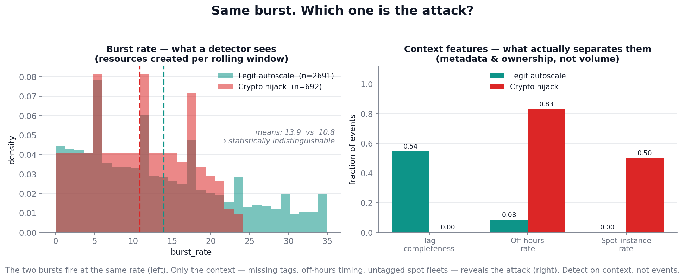

# Ephemeral Cloud & Kubernetes Resource Risk Detection

> **A legitimate autoscaler burst and a crypto-mining hijack are statistically identical at the event level — same API calls, same burst rate. The signal that separates them isn't in the event, it's in the _context_. So we detect on context, not events.**

A near-real-time detection pipeline for the risk that traditional security misses: CI/CD job pods,
spot instances, assumed-role sessions, and autoscaled containers that live for **minutes** and vanish
before a daily scan ever sees them. It discovers ephemeral assets, detects risky transient behavior,
correlates events across cloud + Kubernetes + identity logs into incidents, scores them, and emits
analyst-ready LLM triage narratives with MITRE mapping and remediation.

**🔗 Live demo:** <https://sentinel-rho-sooty.vercel.app/app> · **📹 Demo video:** _add link_ · **📄 Report:** [docs/report.md](docs/report.md) · **📊 Slides:** [docs/slides.md](docs/slides.md)

---

## Why this is hard — the one figure that matters



Most submissions make malicious bursts *bigger* or *faster* than benign ones. That makes the metrics
look great and proves nothing. **Our simulator refuses that shortcut.** Above are two real populations
from our generated data: a legitimate autoscaler burst and a crypto-mining hijack. They fire at the
**same rate** (left — the distributions sit on top of each other). The only thing that separates them
is **context** (right): missing tags, off-hours timing, untagged spot fleets. Any system that detects
on event volume alone fails on exactly the ambiguous cases this project exists to solve.

---

## Architecture

```
[Cloud audit]  [K8s audit]  [Identity/session]
       \           |            /
        v          v           v
  (1) Ingest + enrich   →  unified schema · behavioral cohorts · context features
        |
  (2) Detect            →  always-on tripwires + recall-first anomaly ensemble
        |                  (IsolationForest + ECOD) + cohort-aware suppression
        |
  (3) Cluster           →  NetworkX entity graph; incidents = connected components
        |                  within an identity + namespace + time envelope
        |
  (4) Score             →  fused, isotonic-calibrated risk @ the INCIDENT level (after clustering)
        |
  (5) LLM triage        →  validated structured JSON: intent, confidence, MITRE, guardrails
        |
  (6) Dashboard         →  React SOC console fed by static JSON (offline, demo never needs a network)
```

The four differentiators: **behavioral cohorts** (baseline the cohort, not the ephemeral identity) ·
**two-stage detection** (separate recall from precision) · **graph correlation** (recover cross-source
campaigns time-windowing can't) · **LLM triage agent** (reason over evidence, don't just narrate).

Full design rationale: [docs/ephemeral_risk_detection_analysis.md](docs/ephemeral_risk_detection_analysis.md).
Progress log & decisions: [context.md](context.md).

---

## Results — the ablation table

Each row adds one differentiator; each earns its place. Measured against ground-truth labels we control
(9,857 events, 17.3% risky).

| Configuration | Precision | Recall | Alert reduction |
|---|---:|---:|---:|
| Tripwires only | 43.5% | 72.5% | 38% |
| + Stage-1 anomaly ensemble | 31.1% | 84.2% | 0% |
| + Stage-2 cohort suppression | 33.6% | 84.2% | 8% |
| + Graph correlation | 24.1% | **100%** | **89%** |
| + Risk fusion (incident, band ≥ HIGH) | **68.4%** | 99.5% | 89% |

**Headline numbers:** recall climbs **72% → 100%** (graph bridge-expansion recovers detections the
model missed); alerts collapse **89%** (4,638 raw flags → 529 incidents); and the ranked queue hits
**precision@50 = 96%** — the brief's prescribed risk-quality metric. Correlation accuracy vs injected
`campaign_id`: V-measure **0.93**.

**Alert-fatigue funnel:** 9,857 raw events → 3,517 flagged → 3,167 after suppression → **529
correlated incidents** → 263 triaged. The SOC investigates 529 things, not 9,857.

---

## Run it locally

```bash
pip install -r requirements.txt

# Full pipeline (deterministic, seed 1337)
python -m modules.data_simulation.generator.build   # generate data/raw/
python -m modules.ingest_enrich.build               # → events_enriched.parquet
python -m modules.detection.build                   # → detections.parquet
python -m modules.correlation.build                 # → incidents.parquet
python -m modules.risk_fusion.build                 # → incidents_scored.parquet
python -m modules.llm_triage.build --no-llm         # → incidents_triaged.parquet (offline)
python -m modules.dashboard.build                   # → frontend/public/data/*.json

python -m pytest tests/ -q                           # 50 passed

# Dashboard
cd modules/dashboard/frontend && npm install && npm run dev   # http://localhost:5173/app
```

The dashboard reads **static JSON** exported from the pipeline — no live model or LLM call in the demo
path, so it runs fully offline. The LLM triage (`gpt-4o-mini`) is pre-generated and cached; the
`--no-llm` path and the whole test suite need no API key.

### Deploy (Vercel)

The frontend is a static Vite build with committed data JSON. On Vercel: set **Root Directory** to
`modules/dashboard/frontend`, framework **Vite**, build `npm run build`, output `dist`. The included
[`vercel.json`](modules/dashboard/frontend/vercel.json) rewrites SPA routes to `index.html` (so deep
links like `/app/findings` don't 404) while leaving `/data/*` static.

---

## Honest evaluation (questions a judge should ask)

**"Isn't detecting `cohort=unknown` just detecting the label you injected?"**
No. Confusability is enforced at generation time — the figure above shows benign and malicious bursts
are statistically indistinguishable in volume/rate. The risk-fusion score is **label-free** (built from
anomaly score, exposure, privilege, novelty). The *only* sanctioned label touch is **out-of-fold
isotonic calibration**, where no event is scored by a model that saw its label. We detect the
*behavior*; the label is downstream ground truth used to measure, not to predict.

**"Precision is 68%, the target was 75%."**
68.4% is the deliberately high-recall **band cut** (`band ≥ HIGH`) — a tripwire incident is never
silently dismissed, by design. The brief's actual risk-scoring-quality metric is **precision/recall@K
against severity**, where the ranked incident queue hits **96% @50**. We optimize the ranked queue an
analyst actually works, not a single threshold.

**"It's all synthetic."**
Yes, and that's controlled, not faked: there is no public dataset with the labeled ground truth
(`is_risky`, `campaign_id`, `severity`) this problem requires. The simulator is grounded field-by-field
in real AWS CloudTrail / `audit.k8s.io` / Okta schemas and real burst-timing distributions
([docs/data_resource_research.md](docs/data_resource_research.md)), and every metric is measured against
labels we constructed ground-truth-first.

---

## Repository layout

```
docs/        design doc (source of truth), problem statement, data research, figures/
data/        raw/ (simulated logs + labels) · processed/ (enriched + scored parquet)
modules/     data_simulation · ingest_enrich · detection · correlation ·
             risk_fusion · llm_triage · dashboard (React frontend + JSON export)
tests/       50-test pytest suite across all six stages
```

Built as a hackathon submission for the **Cloud Security Governance & Risk** track. Frameworks mapped:
NIST SP 800-53 (CM-8, SI-4, IR-4), MITRE ATT&CK (T1496, T1578, T1190), CIS Kubernetes, GDPR Art. 32.
