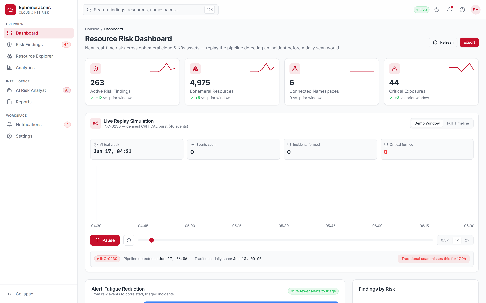
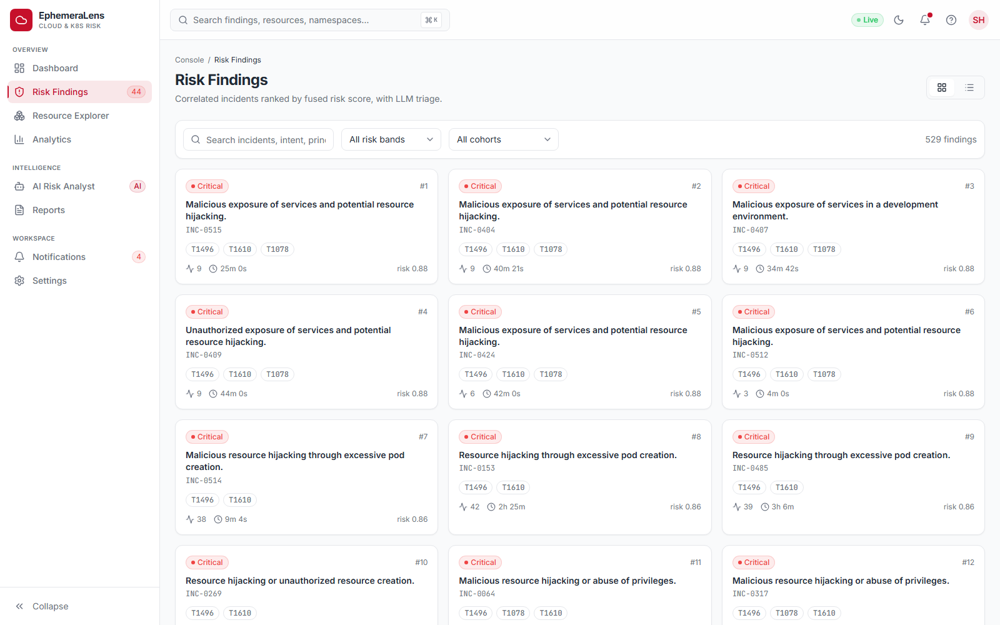
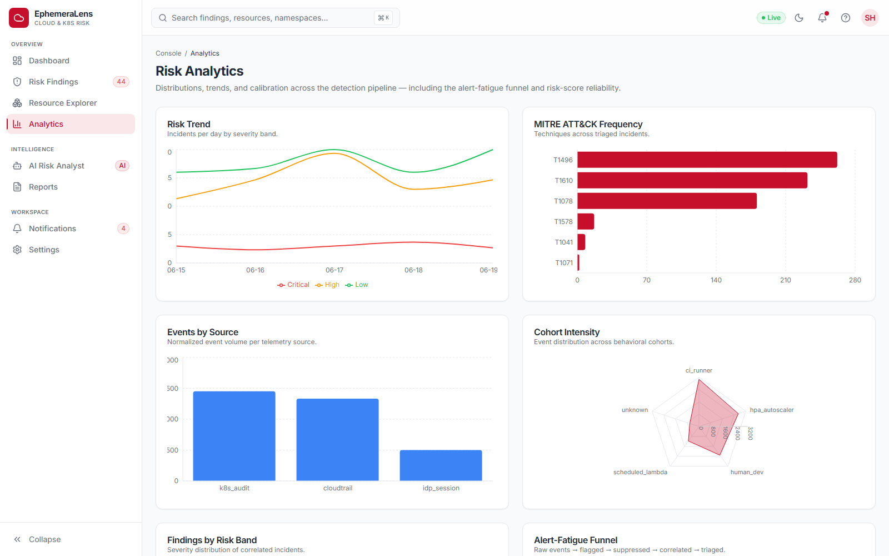
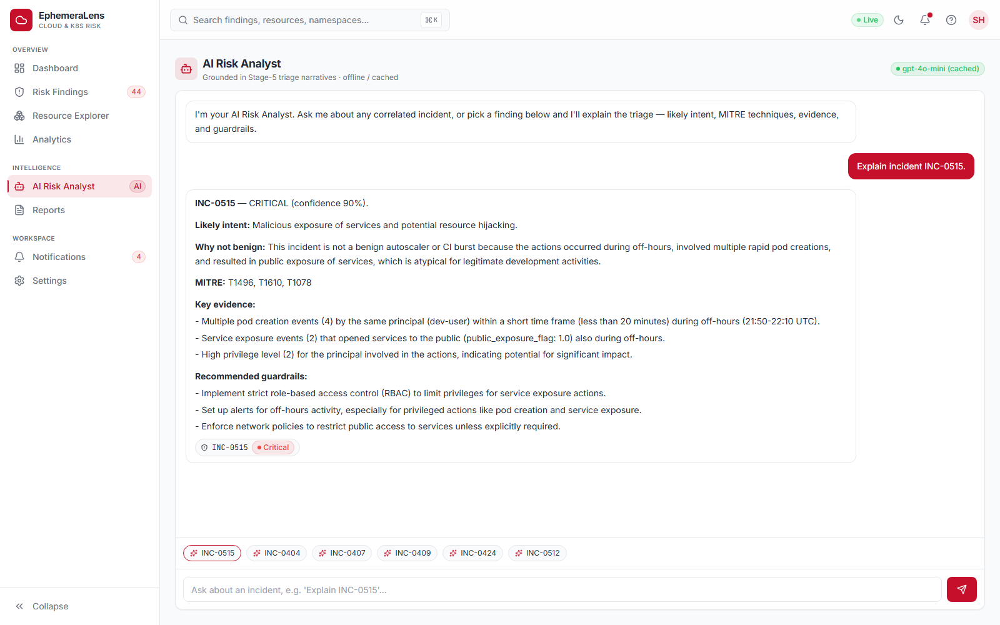
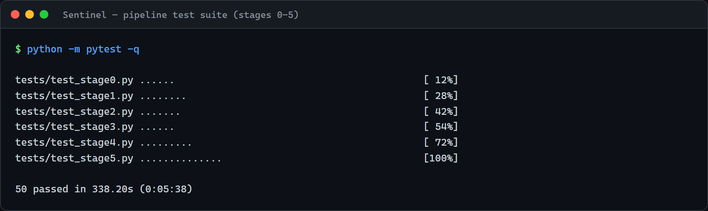

# Sentinel: Ephemeral Cloud & Kubernetes Resource Risk Detection

**Detect on *context*, not events.** Sentinel ingests cloud/Kubernetes telemetry, enriches and
correlates it into incidents, scores them with a fused risk model, and triages the top incidents
with an LLM, surfacing real attacks (resource hijacking, credential abuse, malicious service
exposure) **before a once-a-day scan would even run**.

🔗 **Live demo:** https://sentinel-rho-sooty.vercel.app/app

> Presented as **EphemeraLens** in the console UI. Detection is grounded in MITRE ATT&CK technique
> mapping and a confusability-aware model that separates genuine attacks from benign look-alikes
> (autoscaler bursts, CI runners, scheduled jobs).

## 📸 Screenshots

### Resource Risk Dashboard
Near-real-time risk across ephemeral assets, with a **live replay simulation** that re-plays an
incident's events and shows it being detected ~18h before a traditional daily scan.



### Risk Findings
Correlated incidents ranked by fused risk score, each tagged with MITRE ATT&CK techniques
(e.g. T1496, T1610, T1078), event counts, and duration.



### Risk Analytics
Distributions, trends, and calibration across the pipeline: risk trend by severity band,
MITRE technique frequency, events by telemetry source, cohort intensity, and the alert-fatigue
funnel (raw events → flagged → suppressed → correlated → triaged).



### AI Risk Analyst (LLM triage)
Ask about any incident and get a grounded triage: likely intent, why-not-benign reasoning, MITRE
techniques, key evidence, and recommended guardrails.



### Tested pipeline (50 passing tests)
Every stage has a dedicated test module; the full suite passes end-to-end.



## 🏗️ Pipeline

Staged, deterministic, and individually tested (`tests/test_stage0…5.py`, **50 tests, all passing**):

| Stage | Module | Role |
|---|---|---|
| 0–1 | `data_simulation`, `ingest_enrich` | Generate/ingest telemetry and enrich events |
| 2 | `detection` | Anomaly + rule detection (incl. PyOD ECOD) |
| 3 | `correlation` | Correlate events into incidents (alert reduction) |
| 4 | `risk_fusion` | Fuse signals into a calibrated, ranked risk score |
| 5 | `llm_triage` | Cached LLM triage narratives per incident |
| 6 | `dashboard` | React + Vite console (EphemeraLens) + analytic figures |

## 🚀 Running locally

```bash
# Pipeline tests (Python)
pip install pyod          # plus numpy/scipy/scikit-learn/pandas/pyarrow
python -m pytest -q

# Dashboard (React + Vite)
cd modules/dashboard/frontend
npm install && npm run dev
```

Processed pipeline artifacts live in `data/processed/` (`incidents_scored.parquet`,
`incidents_triaged.parquet`, per-incident triage cache, etc.).
