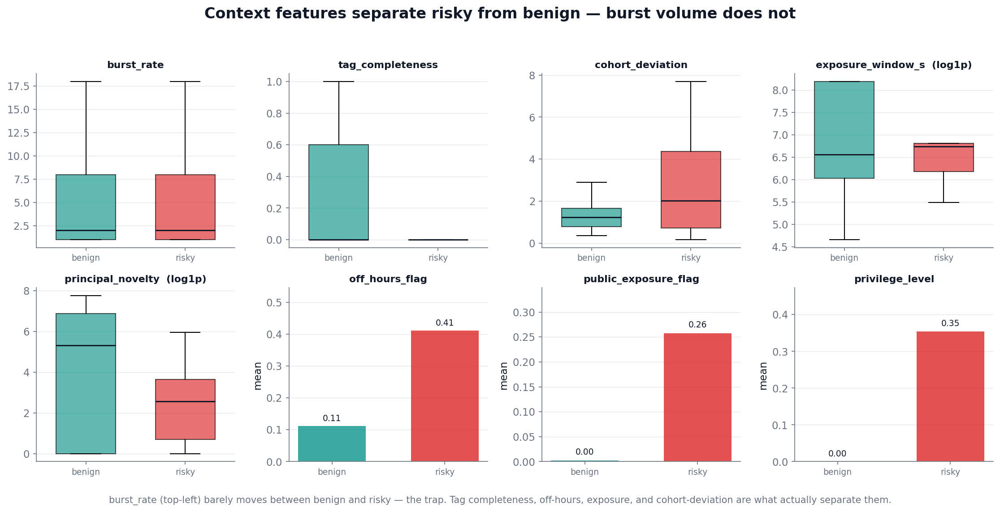
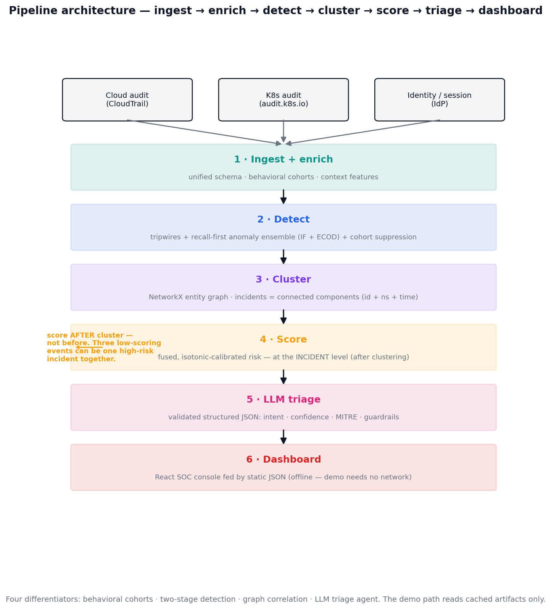
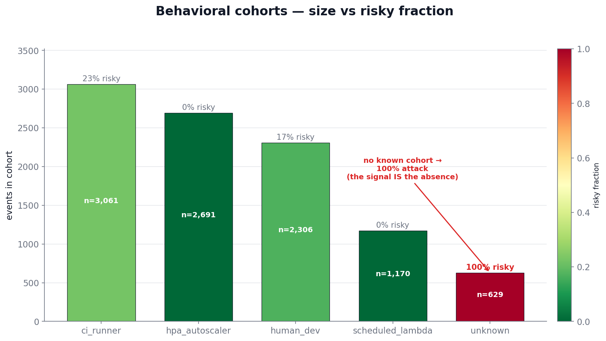
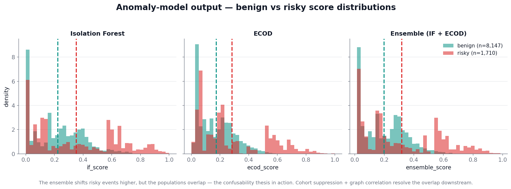
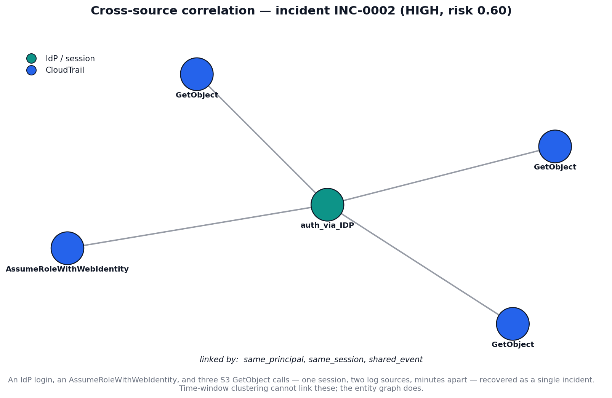
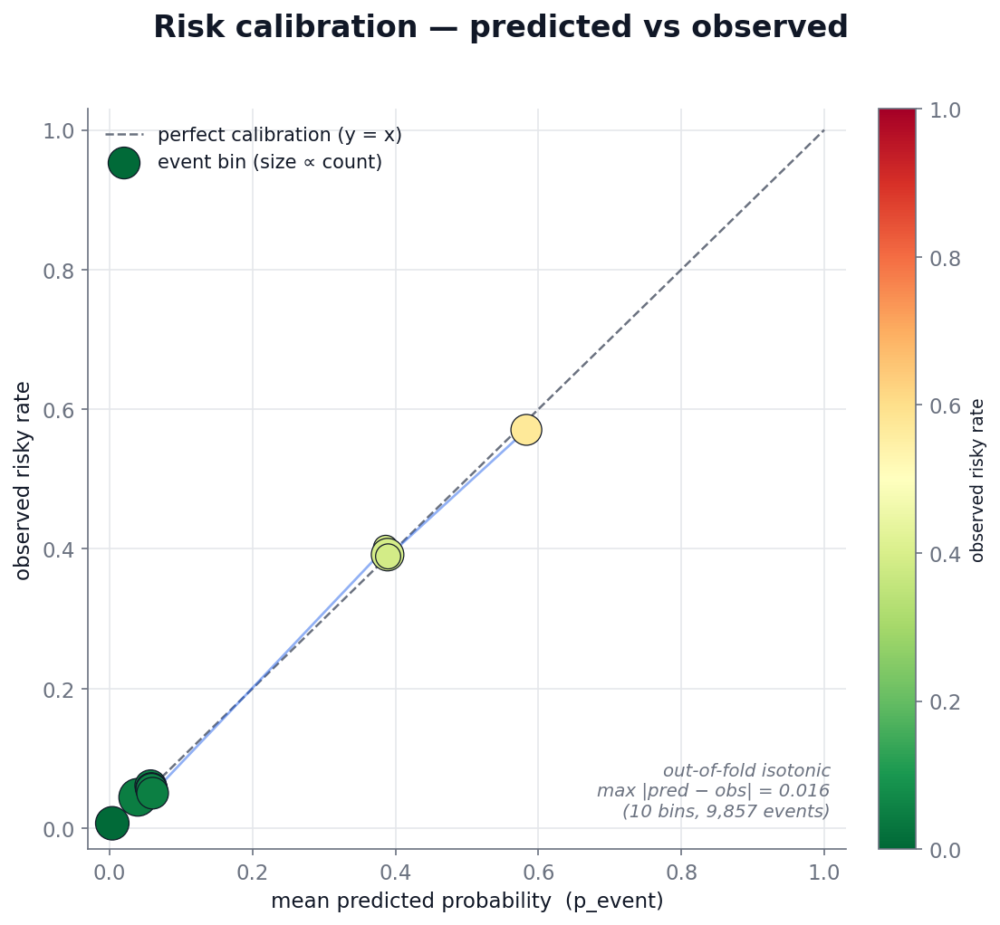
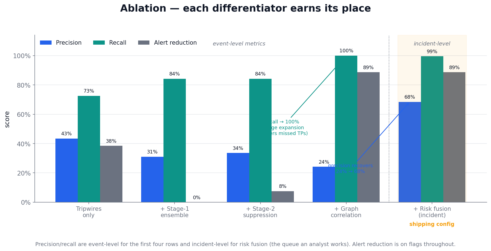
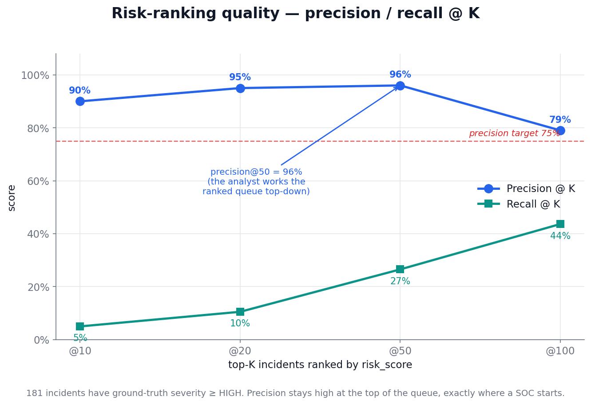
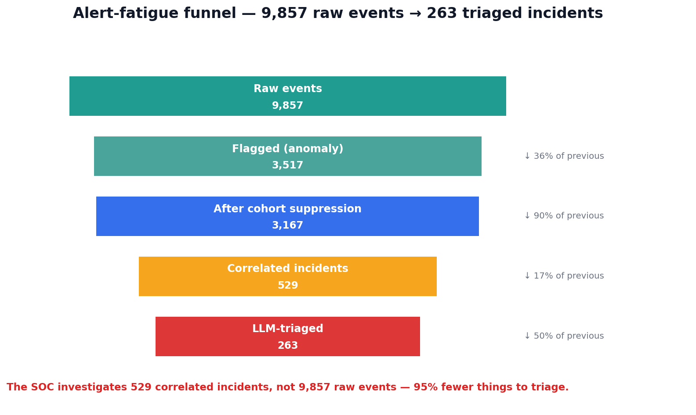
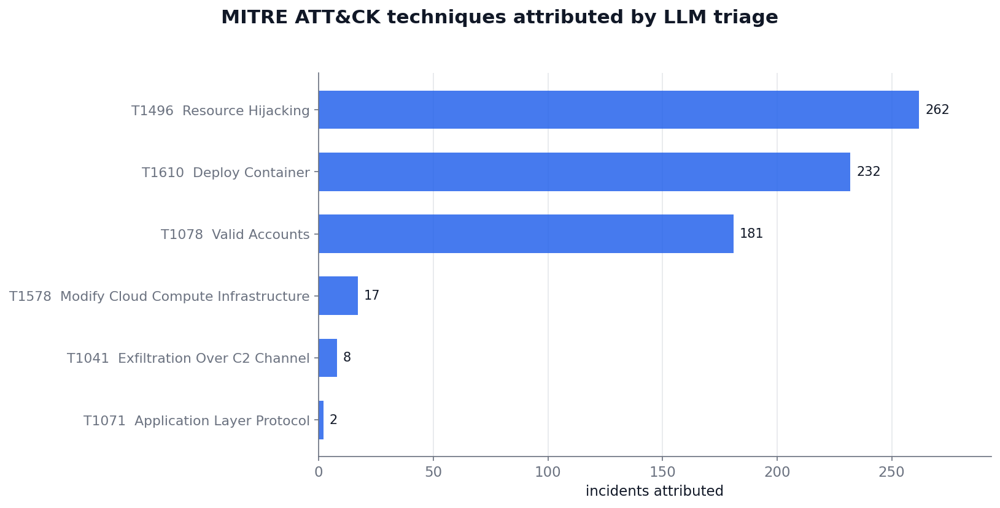

# Ephemeral Cloud & Kubernetes Resource Risk Detection

**Technical Report — Hackathon Submission**
**Track:** Cloud Security Governance & Risk

**🔗 Live demo:** <https://sentinel-rho-sooty.vercel.app/app> · **📹 Demo video:** _add link_ · **Repository:** _add GitHub URL_

---

> **A legitimate autoscaler burst and a crypto-mining hijack are statistically identical at the event level — same API calls, same burst rate. The signal that separates them isn't in the event, it's in the _context_. So we detect on context, not events.**

---

## 1. The Problem

Modern cloud and Kubernetes infrastructure runs on **ephemeral resources** — CI/CD job pods, spot
instances, assumed-role sessions, and autoscaled containers that live for *minutes* and then vanish.
Traditional security controls were built for a world of stable, long-lived assets, and they break on
every assumption ephemerality violates:

| Traditional assumption | Ephemeral reality |
|---|---|
| Assets are stable; inventory can be synced daily | Assets exist for minutes; a daily sync never sees them |
| Each alert maps to a durable resource to investigate | The resource is gone before triage; no forensic evidence remains |
| Identities are long-lived and can be baselined | Sessions have 15-minute TTLs; there is no stable identity to baseline |
| Alert volume is manageable | Autoscaling and CI/CD generate thousands of near-identical events |

### 1.1 The four canonical incidents (concrete business impact)

1. **Crypto-mining via a compromised CI/CD account** — 20 spot VMs spun up at 3 AM, terminated before
   the SOC shift began. Cost: **~$14,000 in 90 minutes; zero alerts fired.** Demands off-hours +
   novelty + cohort-deviation detection, and detection latency *shorter than the resource lifetime*.

2. **Debug pod with NodePort exposed to `0.0.0.0/0`** — ran 11 minutes, exploited by an external
   scanner, and died before any scan could catch it. Demands exposure scoring that distinguishes a load
   balancer (public IP is normal) from a debug pod (public IP is dangerous).

3. **Assumed-role session reads PII from S3** — the session expired in 15 minutes and was never
   correlated to the compromised Lambda that triggered it. Demands cross-source graph correlation
   linking Lambda → session → S3 access.

4. **Autoscaler burst of 40 pods** — 40 false-positive alerts buried one real credential-abuse alert.
   Demands correlation that collapses 40 alerts into 1 incident, plus suppression of cohort-normal
   bursts.

---

## 2. Why This Is Hard — The Confusability Thesis

Every hard case in this problem is a pair of look-alikes the system must separate:

- 40 pods in 2 minutes → **HPA autoscale** or **resource hijacking**?
- Spot VM with a public IP and no tags → **misconfigured CI job** or **attacker staging**?
- Assumed-role session hits S3 at 3 AM → **scheduled Lambda** or **compromised credential**?
- Privileged debug pod runs 5 minutes → **developer troubleshooting** or **container escape**?


The figure above shows two **real populations from our generated data**: a legitimate autoscaler burst
and a crypto-mining hijack. They fire at the **same rate** (left — the `burst_rate` distributions sit
directly on top of each other, mean 10.8 vs 13.9). The only thing that separates them is **context**
(right): tag completeness (0.00 vs 0.54), off-hours timing (0.83 vs 0.08), and untagged spot fleets
(0.50 vs 0.00).

**This is the design discipline most submissions skip.** It is trivial to make malicious bursts
*bigger* or *faster* than benign ones — that makes the metrics look great and proves nothing, because
it makes the noise-reduction problem disappear. Our simulator deliberately refuses that shortcut: every
malicious scenario ships a volume- and timing-matched benign twin, differing only in metadata
completeness and ownership. Any system that detects on event volume alone fails on exactly the
ambiguous cases this project exists to solve.

The confusability figure above is the three-feature teaser for one scenario pair. The same effect holds
across **all eight context features and the entire dataset** (8,147 benign vs 1,710 risky events):



`burst_rate` (top-left) barely moves between benign and risky — that's the trap a volume detector falls
into. Tag completeness, off-hours timing, exposure window, and cohort-deviation are what actually carry
the separation.

**The conclusion that drives every design decision: detect on context, not events.**

---

## 3. Architecture

The pipeline follows the brief's prescribed order literally: `ingest → enrich → detect → cluster →
score → LLM narrative → dashboard`.

```mermaid
flowchart TD
    CT[Cloud audit<br/>CloudTrail]:::src --> S1
    K8[K8s audit<br/>audit.k8s.io]:::src --> S1
    IDP[Identity / session<br/>IdP]:::src --> S1
    S1[1 · Ingest + enrich<br/><small>unified schema · behavioral cohorts · context features</small>] --> S2
    S2[2 · Detect<br/><small>tripwires + recall-first anomaly ensemble (IF + ECOD) + cohort suppression</small>] --> S3
    S3[3 · Cluster<br/><small>NetworkX entity graph · incidents = connected components (id + ns + time)</small>] --> S4
    S4[4 · Score<br/><small>fused, isotonic-calibrated risk — at the INCIDENT level, AFTER clustering</small>] --> S5
    S5[5 · LLM triage<br/><small>validated structured JSON: intent · confidence · MITRE · guardrails</small>] --> S6
    S6[6 · Dashboard<br/><small>React SOC console fed by static JSON — offline, demo needs no network</small>]
    classDef src fill:#f3f4f6,stroke:#111827;
```

*(For PDF/PPT renderers without Mermaid support, the same diagram is committed as
[`figures/architecture.png`](figures/architecture.png).)*



### The four differentiators

1. **Behavioral cohorts replace per-identity baselines.** Ephemeral identities have no stable history,
   so we cluster principals into cohorts (`ci_runner`, `hpa_autoscaler`, `human_dev`,
   `scheduled_lambda`) and baseline the *cohort*. A brand-new pod inherits its cohort's baseline
   instantly — converting the brief's stated blocker ("no stable identity to baseline") into the
   solution's strongest signal.

2. **Two-stage detection separates recall from precision.** Stage 1 is a recall-first anomaly ensemble
   (Isolation Forest + ECOD) where over-flagging is expected and acceptable. Stage 2 suppresses
   candidates that are normal *for their cohort*. This is how high recall and meaningful alert reduction
   are achieved simultaneously instead of being traded against each other.

3. **Graph correlation surfaces campaigns time-windowing cannot.** A NetworkX graph with time-gated,
   typed edges links related events across all three sources. This is what collapses 40 autoscaler
   alerts into 1 incident and recovers the Lambda → assumed-role session → S3 chain that occurs over
   minutes and across log boundaries.

4. **The LLM is a triage agent, not a prose generator.** It returns *validated structured JSON*
   (intent, confidence, MITRE techniques, guardrails) under a strict schema with retry and a templated
   fallback. Responses are cached so the live demo never depends on a network call.

### The critical ordering catch — score *after* clustering

Three individually low-scoring events from the same principal in the same five-minute window can be one
high-severity incident *together*. Per-event scoring before clustering misses that. Risk scoring
therefore happens at the **incident level, after correlation** — never before.

---

## 4. How Each Stage Works

**Stage 0 — Data simulation.** Generates three labeled, synthetic log streams (CloudTrail,
`audit.k8s.io`, Okta-style IdP — 9,857 events over a 5-day span, fixed seed 1337). Built
ground-truth-first: the real incident structure is constructed first, then every record and label is
derived from it. Each row carries `is_risky`, `scenario_type`, `cohort`, and `campaign_id` (shared
across all events of one attack, across all three sources). Schemas are grounded field-by-field in real
AWS / Kubernetes / Okta record formats. A 16-check validator gates the dataset.

**Stage 1 — Ingest + enrich.** Normalizes all three sources into one unified schema, assigns behavioral
cohorts via deterministic rules (K8s service-account → CloudTrail role → IdP email prefix → source-IP
CIDR), and computes the eight context features (burst rate, novelty, tag completeness, privilege,
exposure, off-hours, cohort deviation). Principals matching no known cohort become `unknown` — *itself a
signal*, not silently forced into the wrong baseline.



The `unknown` cohort is the proof: all 629 of its events are the identity-anomaly attack (100% risky).
"Fits no cohort baseline" is not noise to be cleaned up — it *is* the detection signal. Cohort accuracy
on the 9,228 recognizable principals is 100%.

**Stage 2 — Detection.** Always-on **tripwires** force a severity floor (NodePort `0.0.0.0/0`, bare
privileged pod, `burst_rate > 10`, broad RBAC, and `cohort == unknown`). A recall-first **ensemble**
(Isolation Forest primary + ECOD second vote, scores min-max normalized and averaged) flags the top
candidates. A no-ML **suppression** pass drops candidates that are cohort-normal.



The ensemble shifts risky events to higher scores, but — honestly — the populations *overlap*. That
overlap is the confusability thesis in action, not a model failure: the right tail is clearly more
risky, but the ambiguous middle is exactly what the cohort suppression and graph correlation stages
resolve downstream.

**Stage 3 — Correlation.** Builds an event-node graph with time-gated typed edges (`same_principal`,
`same_session`, `external_session`, `shared_event`, `same_resource`), each enforcing the
identity + namespace + time envelope at edge-creation time. Incidents are connected components seeded
from flagged events with one-hop bridge expansion. This both collapses noise **and recovers missed
detections** — benign bridge events one hop from a flagged seed pull the missed true positives back in.



This is the payoff time-window clustering cannot reach: an IdP login, an `AssumeRoleWithWebIdentity`,
and three S3 `GetObject` calls — one session, two log sources, minutes apart — recovered as a single
incident via `same_principal` / `same_session` / `shared_event` links.

**Stage 4 — Risk fusion.** Computes a **label-free** event-level raw risk (fixed-weight fusion of
anomaly score, tripwire signal, exposure, privilege, novelty), calibrates it to a probability via
**out-of-fold isotonic regression** (the one sanctioned label touch — no event is scored by a model
that saw its label), then aggregates to an incident `risk_score` (`0.7·max + 0.3·mean` of member
probabilities) with severity bands and a tripwire floor.



Calibration is near-perfect: across ten event bins the predicted probability tracks the observed risky
rate with a maximum deviation of **0.016**. A `p_event` of 0.8 really does mean ~80% likely-malicious,
so the ranked incident queue is meaningfully ordered.

**Stage 5 — LLM triage.** Builds an evidence bundle per CRITICAL/HIGH incident and asks `gpt-4o-mini`
(strict JSON-schema structured output) for intent, confidence, MITRE techniques, disambiguation,
evidence, and guardrails. Validated, retried, cached per incident, with a deterministic label-free
template fallback so the stage never crashes and reruns cost nothing.

**Stage 6 — Dashboard.** A React 19 + Vite + Tailwind SOC console ("Sentinel") fed by **static
JSON** exported from the pipeline — no live model or LLM in the demo path. Headline feature: a
real-time **replay simulation** that plays the 5-day event stream against a virtual clock, forming
incidents live and contrasting pipeline detection time against the next daily scan.

### Data artifacts — what each stage writes

The pipeline persists every stage to Parquet, so each transform is independently inspectable and
1:1-joinable on `record_id` / `incident_id`. The backbone tables:

| Artifact | Rows × cols | Key columns (beyond the unified event schema) |
|---|---|---|
| `events_enriched.parquet` | 9,857 × 43 | `cohort`, `burst_rate`, `principal_novelty`, `tag_completeness`, `privilege_level`, `public_exposure_flag`, `exposure_window_s`, `off_hours_flag`, `cohort_deviation` |
| `detections.parquet` | 9,857 × 51 | + `tripwire_hit`, `severity_floor`, `if_score`, `ecod_score`, `ensemble_score`, `is_candidate`, `is_suppressed`, `predicted_risky` |
| `incidents_scored.parquet` | 529 × 26 | `incident_id`, `member_record_ids`, `event_count`, `edge_types`, `source_{cloudtrail,k8s,idp}_count`, `risk_score`, `risk_band`, `risk_rank` |
| `events_scored.parquet` | 9,857 × 3 | `record_id`, `raw_risk`, `p_event` (calibrated probability) |
| `incidents_triaged.parquet` | 263 × 11 | `likely_intent`, `confidence`, `mitre[]`, `key_evidence[]`, `disambiguation`, `recommended_guardrails[]`, `triage_source` |

The unified event schema (carried by every enriched/detection row) spans identity (`record_id`,
`event_time`, `source`, `action`, `principal_id`/`type`/`arn`, `role_name`), AWS/IAM (`region`,
`session_name`, `session_ttl`, `assumed_role_id`, `shared_event_id`), Kubernetes (`namespace`,
`controller_owner`, `privileged`, `host_network`, `service_type`, `exposed_open`, `rbac_change`,
`broad_rbac`), network/session (`source_ip`, `public_ip`, `external_session_id`), and resource
(`resource_id`/`type`, `is_spot`, `tags`, `labels`, `read_only`) columns — plus the full original
`raw` JSON for forensics.

---

## 5. Results

Each row of the ablation table adds exactly one differentiator, measured against the ground-truth labels
we control (9,857 events, 17.3% risky). The table is the single most persuasive artifact — it proves
each differentiator earns its place.

| Configuration | Precision | Recall | Alert reduction |
|---|---:|---:|---:|
| Tripwires only | 43.5% | 72.5% | 38% |
| + Stage-1 anomaly ensemble | 31.1% | 84.2% | 0% |
| + Stage-2 cohort suppression | 33.6% | 84.2% | 8% |
| + Graph correlation | 24.1% | **100%** | **89%** |
| + Risk fusion (incident, band ≥ HIGH) | **68.4%** | 99.5% | 89% |



(Precision and recall are event-level for the first four rows and incident-level for the risk-fusion
row — the queue an analyst actually works. Alert reduction is on flags throughout.)

**Headline numbers:**

- **Recall climbs 72% → 100%** — graph bridge-expansion recovers detections the anomaly model missed.
- **Alerts collapse 89%** — 4,638 raw flags become 529 correlated incidents. The SOC investigates 529
  things, not 9,857.
- **Ranked queue hits precision@50 = 96%** (and @10 = 90%, @20 = 95%) — the brief's prescribed
  risk-quality metric (precision@K against injected severity).
- **Correlation accuracy vs injected `campaign_id`:** homogeneity 0.88 / completeness 0.99 /
  **V-measure 0.93**.
- **Calibration is near-perfect:** in every reliability bin, predicted probability ≈ observed risky rate.



Precision stays high at the *top* of the queue — exactly where a SOC analyst starts. This is the honest
risk-quality metric, not a single threshold tuned to look good.

**Alert-fatigue funnel:** 9,857 raw events → 3,517 flagged → 3,167 after suppression → **529 correlated
incidents** → 263 triaged.



**Canonical incident recovery:** INC-A (crypto burst) 40 alerts → 1 incident; INC-B (debug pod) 3 → 1;
INC-C (compromised session) 7 → 1 (spanning CloudTrail + IdP); INC-D (autoscaler noise) correctly keeps
the buried credential-abuse alert as its own HIGH incident while collapsing the surrounding noise.

---

## 6. Honest Evaluation — Questions a Judge Should Ask

**"Isn't detecting `cohort = unknown` just detecting a label you injected?"**
No. Confusability is enforced at *generation* time — the figure in §2 shows benign and malicious bursts
are statistically indistinguishable in volume and rate. The risk-fusion score is **label-free** (anomaly
score, exposure, privilege, novelty). The *only* sanctioned label touch is out-of-fold isotonic
calibration, where no event is scored by a model that saw its label. We detect the *behavior*; the label
is downstream ground truth used to *measure*, not to predict.

**"Precision is 68%, but the target was 75%."**
68.4% is the deliberately high-recall **band cut** (`band ≥ HIGH`) — by design, a tripwire incident is
never silently dismissed. The brief's actual risk-scoring-quality metric is **precision/recall@K against
severity**, where the ranked incident queue hits **96% @50**. We optimize the ranked queue an analyst
actually works top-down, not a single global threshold.

**"It's all synthetic."**
Yes, and that is controlled, not faked. No public dataset carries the labeled ground truth (`is_risky`,
`campaign_id`, `severity`) this problem requires. The simulator is grounded field-by-field in real AWS
CloudTrail / `audit.k8s.io` / Okta schemas and real burst-timing distributions, and every metric is
measured against labels we constructed ground-truth-first.

---

## 7. Framework Alignment

| Framework | Controls addressed |
|---|---|
| **NIST SP 800-53** | CM-8 (system component inventory of ephemeral assets), SI-4 (system monitoring), IR-4 (incident handling) |
| **MITRE ATT&CK** | T1496 (Resource Hijacking), T1578 (Modify Cloud Compute Infrastructure), T1190 (Exploit Public-Facing Application), T1610 (Deploy Container), T1078 (Valid Accounts) |
| **CIS Kubernetes Benchmark** | privileged-container and network-exposure controls (tripwire rules) |
| **GDPR Art. 32** | security of processing — the PII-exfiltration incident (INC-C) is detected and triaged |

The MITRE mapping is not hand-waved — it is what the Stage-5 triage agent actually attributes across the
triaged incidents:



---

## 8. Reproducibility

The full pipeline is deterministic (fixed seed 1337) and reproducible end-to-end:

```bash
pip install -r requirements.txt

python -m modules.data_simulation.generator.build   # generate data/raw/
python -m modules.ingest_enrich.build               # → events_enriched.parquet
python -m modules.detection.build                   # → detections.parquet
python -m modules.correlation.build                 # → incidents.parquet
python -m modules.risk_fusion.build                 # → incidents_scored.parquet
python -m modules.llm_triage.build --no-llm         # → incidents_triaged.parquet (offline)
python -m modules.dashboard.build                   # → frontend/public/data/*.json
python -m modules.dashboard.figures.build_all       # → docs/figures/*.png (every figure in this report)

python -m pytest tests/ -q                          # 50 passed

cd modules/dashboard/frontend && npm install && npm run dev   # http://localhost:5173/app
```

The dashboard reads **static JSON** exported from the pipeline — no live model or LLM call in the demo
path, so it runs fully offline. The LLM triage (`gpt-4o-mini`) is pre-generated and cached; the
`--no-llm` path and the entire test suite need no API key. Every figure in this report regenerates from
the same Parquet artifacts via `build_all` — none are hand-drawn or mocked.

---

**🔗 Live demo:** <https://sentinel-rho-sooty.vercel.app/app> · **📹 Demo video:** _add link_ · **Repository:** _add GitHub URL_
